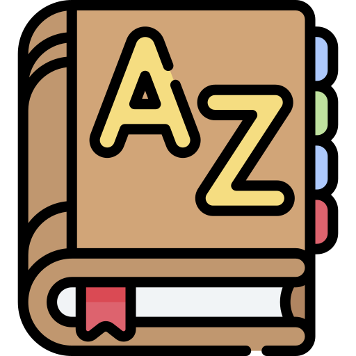

<h1 align="center">lexicon_bot</h1>

	

## About
`lexicon_bot` is a simple chatbot created to bridge information flow between the 
Lexicon project and the Wh00t messaging app.

## Commit Conventions
Git commits follow [Conventional Commits](https://www.conventionalcommits.org) message style as
explained in detail on their website.

 

    <a href="https://www.flaticon.com/free-icons/dictionary" title="dictionary icons">
        lexicon_bot icon created by Freepik - Flaticon
    </a>

